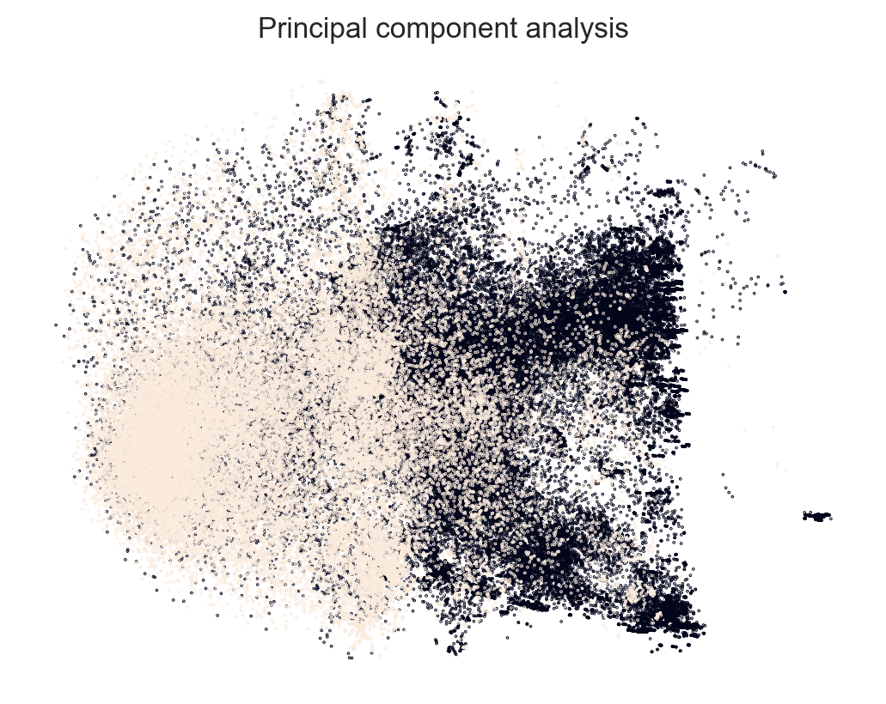

## Fishing classification project

### Installation 

Assuming you have python3 you can run locally by running 
```
pip install numpy pandas matplotlib seaborn geopy scikit-learn xgboost
```

The main script can be run using: 

```
python classification.py --data_dir path_to_parquet
```

You can also run the code interactively in [Google colab](https://colab.research.google.com/github/manuflores/fishing_classification_project/blob/main/classifier.ipynb)

### Design choices and analysis

I started using a very simple Logistic Regression model to get a baseline for the accuracy using only the boat's `course`, `lat` and `lon` and `speed`. I found that this simple model was close to being random, with an accuracy on the test set of $0.57$.


After making some simple data exploration I found that whether boats are classified as fishing or not was **based on purely local behavior**, and not necessarily on the boat speed and or relative position. Hence I decided to compute a series of features to extract this local behavior. These are some of the variables I calculated: 

* speed difference
* acceleration 
* speed and acceleration summary stats: mean, min, max, std
* relative displacement with respect to a previous timestep
* previous 10 values of course,speed,lat,lon

After these transformations I improved the accuracy of a Logistic Regression model to $0.85$, which I believed to be a good starting point to increase model complexity to arrive at a better accuracy. The linear separability can be visualized with a PCA: 





I found that a Random Forest model was a good performer achieving accuracy of $0.96$, and an F1-score of $0.97$. 


I performed 5-Fold cross validation to ensure that this model was not overfitting and found an accuracy of $0.9683 ± 0.0009$. 

Using feature importance analysis I found that the Random Forest performed well by aggregating speed values of previous the timesteps. With this result, I predict that using an RNN or Transformer model that ingests data from a window of $k$ previous timesteps would be an even better predictive model.

